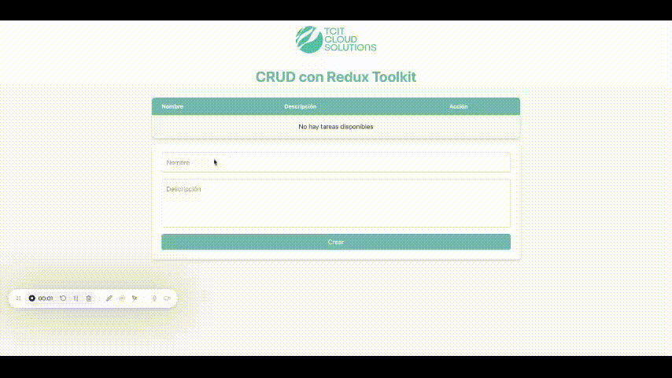

  

# TCIT - Proyecto de Desarrollo Web

Challenge de desarrollo de aplicación en React con backend en Ruby on Rails o NodeJS, Base de datos SQL.

- **Frontend**: [Repositorio del frontend](https://github.com/jonathanleivag/tcit-frontend.git)
- **Backend**: [Repositorio del backend](https://github.com/jonathanleivag/tcit-backend.git)

Cada repositorio contiene su propia guía de instalación y documentación específica.
 

## Notas importantes

- El contenido solicitado en el Challenge se encuentra en la rama `TCIT` tanto en el frontend como en el backend.
- La rama `master` (o `main`) contiene el CRUD completo y funcionalidades adicionales.
- Es importante que ambos proyectos estén sincronizados en la **misma rama** (`TCIT` o `master/main`) para evitar errores o inconsistencias.

## Tecnologías utilizadas

- Frontend: React 19, Vite, Redux Toolkit, Tailwind CSS
- Backend: Node.js, Express, PostgreSQL, Prisma ORM

  

